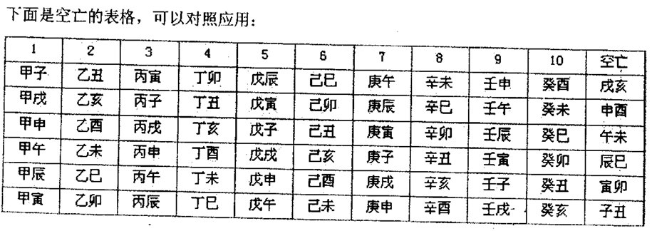

空亡:

1.概念：空亡就是对于当前柱而言(年柱,月柱,日柱,时柱,大运柱,流年柱六柱当中任选其一),在其他的五柱中存在一个或者多个八字,对当前柱丧失任何作用
    
2.原理:命理体系中存在两个概念，十天干(甲乙丙丁戊己庚辛壬癸)，十二地支（子丑寅卯辰巳午未申酉戌亥），这二者共同组成了六十甲子
      由于十天干只能配十个地支，所以多出来的两个地支就叫做空亡，这就意味着这两个地支，对当前这一行中的任意一个天干地支组合都是不起作用的

3.图表

4.举例：以上图为例，第一行为甲子~癸酉,这一行的空亡地支为 戌亥，那么就意味着，甲子~癸酉中的任意一种组合成为日柱，那么剩下的五柱的地支中只要出现了戌亥,那个地支就落了空亡
  
    乾造
      丙 丁 甲 辛
      
      子 戌 子 亥 
       
日柱甲子，甲子的空亡是戌亥,戌亥出现在了月柱和时柱上,这就叫月柱时柱空亡。
按照祝树英老师的讲法,空亡以日柱为主，如果判断日干旺衰则只在月柱时柱上找,因为月柱时柱离日干最近，影响力最大，
能够决定日干的旺衰，但是空亡不仅仅只会出现在月时两柱，它可能出现在日柱以外的任意一柱。除了判断日主的旺衰,还可以从地支的十神角度做判断

例如上面的八字，甲木身弱，月支时支落空亡,戌土为甲木的偏财，亥水为甲木的偏印:
月柱兄弟宫偏财落空亡，有财也无财，得不到长辈朋友帮助，且按照十神六亲图来看，偏财为父，那么也克父
时柱子女宫偏印落空亡：晚年和子女权位学业学术难成，不利母亲。

十神空亡的简易公式：

比肩逢空亡：手足少或不和穆，对自己没帮助，兄弟姐妹难依靠，男命妻或财不利，女命则夫缘较薄。

劫财逢空亡：手足不得力，无助益，财难聚，较易虚华浪费。

食神逢空亡：福份减少，寿命不长，男命本人寿不长，女命子女易早夭，有会合或冲可解。

伤官逢空亡：子孤，婚变，再婚。

偏财逢空亡：有残疾在身，不得父缘或不能得到父亲的匡助，父道不利或和父生离死别，无妾缘，无横财运。

正财逢空亡：财产易受到损失，易招盗贼，妻缘薄，晚婚，家庭易生风波，落魄劳苦，容易丧妻。

偏官逢空亡：不能得到长官的扶携，无劝威，男子子息少，女命夫缘差。

正官逢空亡：男命事业受挫，官职不升，不宜公职，少子息；女命与丈夫生离死别，夫缘差。

偏印逢空亡：权位学业学术难成，不利母亲。

正印逢空亡：权位学业学术难成，丧母。

财官都逢空亡：终身为僧道，一生空有抱负，一妻不到头。

官杀都逢空亡：在九流任虚闲之职。